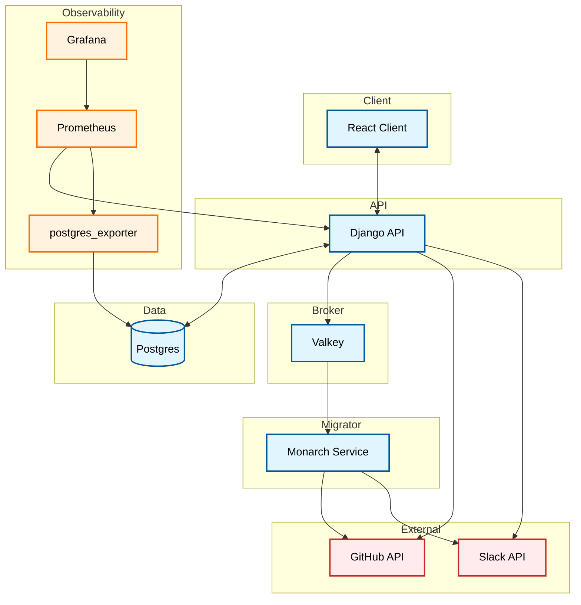

# Tech Stack (AI)

## 1. Run Questions

### 1a. Config Files

#### `learn-ops-infrastructure`

| Config File | Config Value | What it's for | How it's used |
|---|---|---|---|
| `.env` | `POSTGRES_DB`, `POSTGRES_USER`, `POSTGRES_PASSWORD`, `DATA_SOURCE_NAME` | Local Postgres credentials & connection string for the dev database | Loaded via `env_file` by the `database` and `postgres_exporter` services in `docker-compose.yml` |
| `docker-compose.yml` | Service definitions for `database`, `api`, `client`, `prometheus`, `grafana`, `postgres_exporter` (ports, volumes, networks) | Orchestrates the full local dev stack | Run with `docker compose up`; all services join the shared `learningplatform` network |
| `prometheus.yml` | `scrape_configs` for `django` (`api:8000`) and `postgresql` (`postgres_exporter:9187`) | Configures Prometheus metrics scraping | Mounted into the `prometheus` container as a volume in `docker-compose.yml` |

#### `learn-ops-api`

| Config File | Config Value | What it's for | How it's used |
|---|---|---|---|
| `.env` | GitHub OAuth client ID/secret, DB host/port/db/user/password, Valkey connection, Django secret key & allowed hosts, superuser creds, `DEBUG`/`DEVELOPMENT_MODE` flags, Slack bot token, GitHub token, instructor username/cohort | Runtime secrets & settings for the Django API | Loaded via `env_file` in `learn-ops-infrastructure/docker-compose.yml` and read by Django settings |
| `Dockerfile` | Python 3.11.11 base image, `pipenv install`, `entrypoint.sh`, `CMD runserver 0.0.0.0:8000` | Builds the Django API container image | Built by the `api` service in `learn-ops-infrastructure/docker-compose.yml` |
| `pytest.ini` | `DJANGO_SETTINGS_MODULE=LearningPlatform.test_settings`, `testpaths=LearningAPI/tests`, markers (`unit`/`integration`/`slow`) | Configures the pytest/Django test runner | Read automatically when running `pytest` in `learn-ops-api` |
| `config/learn-ops-api.yaml` | DigitalOcean App Platform spec: managed Postgres DB, GitHub repo/branch, `deploy_on_push`, `basic-xxs` instance | Defines the production deployment on DigitalOcean App Platform | Applied via DigitalOcean App Platform (e.g. `doctl apps`) to provision/deploy the API |
| `config/nginx.api.conf` | `server_name learningapi.nss.team`, Certbot SSL certs, `proxy_pass http://127.0.0.1:8000` | Production nginx vhost for the API | Deployed to the production droplet's nginx to reverse-proxy API traffic |
| `config/nginx.client.conf` | `server_name learning.nss.team`, serves React build dir, Certbot SSL certs | Production nginx vhost for the client app | Deployed to the production droplet's nginx to serve the built React app |
| `config/nginx/nginx.conf` | `worker_processes`, gzip settings, `ssl_protocols`, includes `conf.d/*.conf` | Base/global nginx config | Used as the main nginx config in a containerized nginx setup; includes `conf.d/api.conf` |
| `config/nginx/conf.d/api.conf` | `upstream learningapicontainer -> apihost:8000`, CORS headers | Containerized nginx vhost variant for the API | Alternate/legacy config for a Dockerized nginx reverse proxy (possibly unused) |

#### `learn-ops-client`

| Config File | Config Value | What it's for | How it's used |
|---|---|---|---|
| `.env` | `REACT_APP_API_URI`, `REACT_APP_ENV`, `CHOKIDAR_USEPOLLING`, `GENERATE_SOURCEMAP` | Build/runtime config for the React client | Loaded via `env_file` in `docker-compose.yml` and read by Create React App at build/runtime |
| `Dockerfile` | Node 22.13.0 base image, `npm install`, `CMD npm start` | Builds the React client dev container | Built by the `client` service in `learn-ops-infrastructure/docker-compose.yml` |

#### `service-monarch`

| Config File | Config Value | What it's for | How it's used |
|---|---|---|---|
| `.env` | `GH_PAT`, `VALKEY_HOST`, `VALKEY_PORT`, `SLACK_WEBHOOK_URL`, `SLACK_TOKEN` | Runtime secrets for the Monarch service | Loaded via `env_file` in `service-monarch/docker-compose.yml` and read by `service/config/settings.py` |
| `Dockerfile` | Python 3.11-slim base image, `pip install -r requirements.txt`, `CMD python service/main.py` | Builds the Monarch service container | Built by `service-monarch/docker-compose.yml` |
| `docker-compose.yml` | `monarch` service, ports `8080`/`8081`, `env_file: .env`, joins `learningplatform` network | Orchestrates the standalone Monarch service | Run with `docker compose up` in `service-monarch`; joins the shared network to reach Valkey, etc. |
| `service/config/settings.py` | `VALKEY_HOST`/`PORT`/`DB`, `GITHUB_API_URL`, `GH_PAT`, `SLACK_BOT_TOKEN`, rate-limit/pause values, `PROMETHEUS_PORT` | Pydantic settings model for the Monarch service | Imported by Monarch service code to read config/env values at runtime |

### 1b. How to Start It

Run `make up` from `learn-ops-infrastructure` (after one-time `make setup`). Under the hood this runs:
```
docker compose pull --ignore-buildable
docker compose up --build -d
docker compose logs -f
```
This brings up `database`, `api`, `client`, `prometheus`, `grafana`, and `postgres_exporter`.

**Caveat:** `make up` only covers `learn-ops-infrastructure/docker-compose.yml` (database, api, client, prometheus, grafana, postgres_exporter). Two other pieces live in their own compose files and must be started separately, each with `docker compose up` from their own directory:
- `learn-ops-infrastructure/valkey/` — the Valkey message broker
- `service-monarch/` — the ticket migration service (also requires Valkey to already be running)

### 1c. Where to Access It

| Service | Port(s) | URL |
|---|---|---|
| `database` (Postgres) | 5433→5432 | n/a (DB connection, not HTTP) — `postgresql://localhost:5433` |
| `api` (Django) | 8000, 5678 (debugpy) | http://localhost:8000 |
| `client` (React) | 3000 | http://localhost:3000 |
| `prometheus` | 9090 | http://localhost:9090 |
| `grafana` | 3001→3000 | http://localhost:3001 |
| `postgres_exporter` | 9187 | http://localhost:9187/metrics |
| `monarch` (separate stack) | 8080, 8081 | Metrics: http://localhost:8080/ · Log viewer: http://localhost:8081/ · Health: http://localhost:8081/health |

### 1d. Service Dependencies

| Service | Depends On | Why |
|---|---|---|
| `api` | `database` (must be healthy) | Runs migrations/entrypoint setup against Postgres before serving |
| `api` | `valkey` | Publishes messages (e.g. ticket-migration trigger) via Valkey pub/sub |
| `prometheus` | `api` | Scrapes Django metrics from `api:8000` |
| `postgres_exporter` | `database` | Connects to Postgres to export DB metrics |
| `grafana` | `prometheus` | Queries Prometheus as its dashboard data source |
| `monarch` | `valkey` | Subscribes to the `channel_migrate_issue_tickets` channel; per its README, won't start successfully without Valkey running |
| `monarch` | GitHub API, Slack API (external) | Creates issues on target repos and posts migration status |
| `valkey-monitor` | `valkey` | Debug sidecar (`valkey-cli monitor`), not used by the app itself |

**Note:** there are three separate compose files — `learn-ops-infrastructure/docker-compose.yml`, `learn-ops-infrastructure/valkey/docker-compose.yml`, and `service-monarch/docker-compose.yml` — each started independently (see 1b).

### 1e. Main Entry Points

| Service | Startup File | Routes / URL Config File |
|---|---|---|
| `api` (Django) | `manage.py` (invoked via `entrypoint.sh` → `runserver`) | `LearningPlatform/urls.py` (root URLconf) + `LogViewer/urls.py` (sub-app) |
| `client` (React) | `src/index.js` (renders `<Router>` from `react-router-dom`) | `src/components/LearnOps.js` — where the actual `<Routes>` are defined |
| `monarch` | `service/main.py` → `TicketMigrator.run()` | No web "routes" per se — the 8081 log/health interface is a small Flask app in `service/custom_logging/web_interface.py`; the 8080 metrics port is a Prometheus client, not a router |
| `database`, `prometheus`, `grafana`, `postgres_exporter` | n/a — off-the-shelf images, no app code entry point | n/a |

## 2. Services

| Service Name | Tech Stack (including version) | Purpose |
|---|---|---|
| `database` | PostgreSQL 16 | Primary relational datastore for the Learning Platform |
| `api` | Python 3.11.11, Django 5.2.17, Django REST Framework 3.18.0, django-allauth 0.54.0 (GitHub OAuth), django-structlog 5.0.0, django-prometheus, psycopg2-binary, valkey client | Core backend REST API — courses, cohorts, students, GitHub/Slack integration |
| `client` | Node 22.13.0, React 16.13.1, react-router-dom 5.2.0, Radix UI (themes 1.1.2 + components) | Frontend web app instructors/students use |
| `valkey` | Valkey (latest, Redis-compatible) | Pub/sub message broker connecting `api` → `monarch` (and any other subscribers) |
| `monarch` | Python 3.11-slim, Flask 3.0.3, pydantic 2.10.4, prometheus-client 0.21.1, valkey 6.0.2, structlog 24.4.0, tenacity 9.0.0 | Migrates GitHub issue tickets from template repos to student team repos, triggered via Valkey pub/sub |
| `prometheus` | Prometheus (latest) | Scrapes and stores metrics from `api` and `postgres_exporter` |
| `grafana` | Grafana (latest) | Dashboards/visualization on top of Prometheus data |
| `postgres_exporter` | prometheuscommunity/postgres-exporter (latest) | Exposes Postgres metrics in Prometheus format |

## 3. System Overview

**What it is:** A learning-management system for Nashville Software School — instructors track student progress, manage cohorts, and course logistics get automated via GitHub/Slack integration.

**How it's wired together:** Four independent repos, tied together at runtime by a shared Docker network (`learningplatform`) rather than a single deployment unit:
- **`learn-ops-api`** (Django) is the core — owns Postgres, handles GitHub OAuth login, serves the REST API.
- **`learn-ops-client`** (React) talks to the API over HTTP; that's its only integration point.
- **`service-monarch`** is decoupled from the API via message-passing, not HTTP: the API publishes a message on Valkey when repos/students are set up, and Monarch — listening independently — picks it up, creates GitHub issues on student repos, and posts Slack status.
- **Observability** (`prometheus`, `grafana`, `postgres_exporter`) sits alongside, scraping the API and DB — not part of core LMS functionality.
- **`learn-ops-infrastructure`** doesn't run app code itself — it's the orchestration/setup layer (three separate compose stacks + the setup wizard).

**Note:** the architecture diagram in `learn-ops-infrastructure/README.md` shows a planned "Hashtagger Service" (Slack-related) marked "this will be added" — it does not exist in the codebase yet and is omitted from the diagram below.



## Appendix: Startup Details (unsorted)

Notes on how each piece actually starts, gathered while researching 1b — kept here since it didn't cleanly fit that section's format.

### `learn-ops-infrastructure` — the orchestrator

This is the actual starting point for the whole system.

- **First-time setup**: `make setup` runs `scripts/setup.sh`, an interactive wizard that clones the other three repos, collects secrets, forks course repos, writes `.env` files for API/Monarch/client, and (optionally) starts everything.
- **`make doctor`** — check-only mode, verifies prerequisites without changing anything.
- **`make up`** — pulls images and runs `docker compose up --build -d` (all services: database, api, client, prometheus, grafana, postgres_exporter), then tails logs.
- **`make up-api`** / **`make up-client-api`** — start just the API, or API+client, for a lighter dev loop.
- **`make down`** / **`make restart`** / **`make reset`** (destructive — wipes volumes/DB) / **`make ps`** / **`make logs`** round out the lifecycle commands.

### `learn-ops-api` — Django backend

Not started directly — its README says setup is handled by the infrastructure repo above. When the `api` container boots (via infra's `docker-compose.yml`), `entrypoint.sh` runs first: waits for Postgres, generates OAuth/superuser fixtures from env vars, runs migrations, conditionally wipes/loads fixtures, elevates the instructor user, then hands off to `CMD` — `python3 manage.py runserver 0.0.0.0:8000` (or under `debugpy` if `DEBUG=True`).

### `learn-ops-client` — React frontend

Also started via the infra `docker-compose.yml` (its own README just says "clone the repo," no manual steps). Container runs `npm install` then `npm start` (`react-scripts start`, CRA dev server on port 3000).

### `service-monarch` — ticket migration service

Its own README documents standalone startup: copy `.env.template` → `.env`, fill in `GH_PAT`/Slack values, then `docker compose up` from within `service-monarch`. It won't function until the shared Valkey broker (started by the infra stack) is reachable. Container runs `python service/main.py`, which starts `TicketMigrator` listening on the Valkey pub/sub channel.